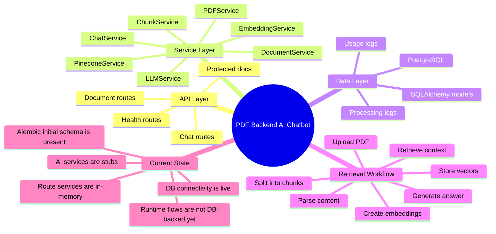
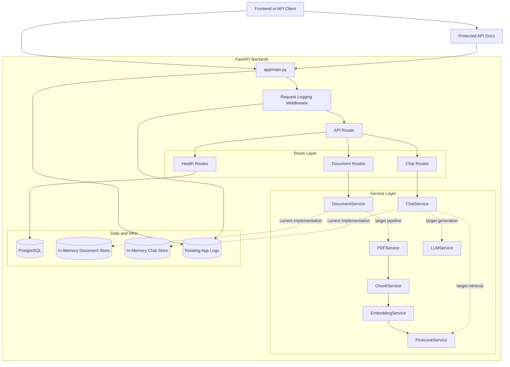
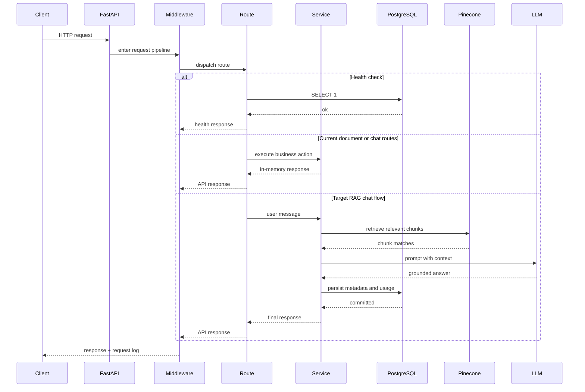
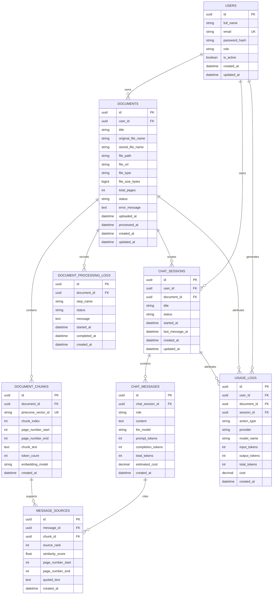
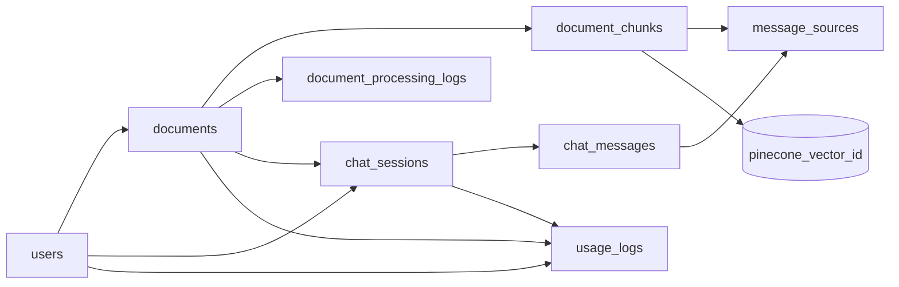
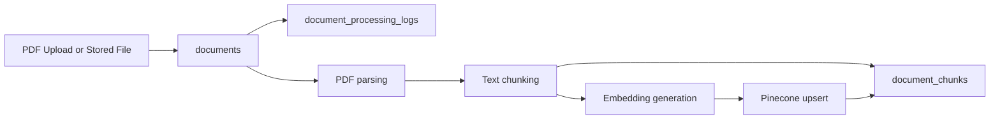
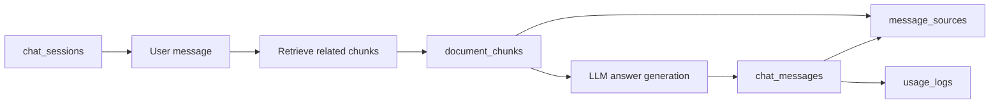
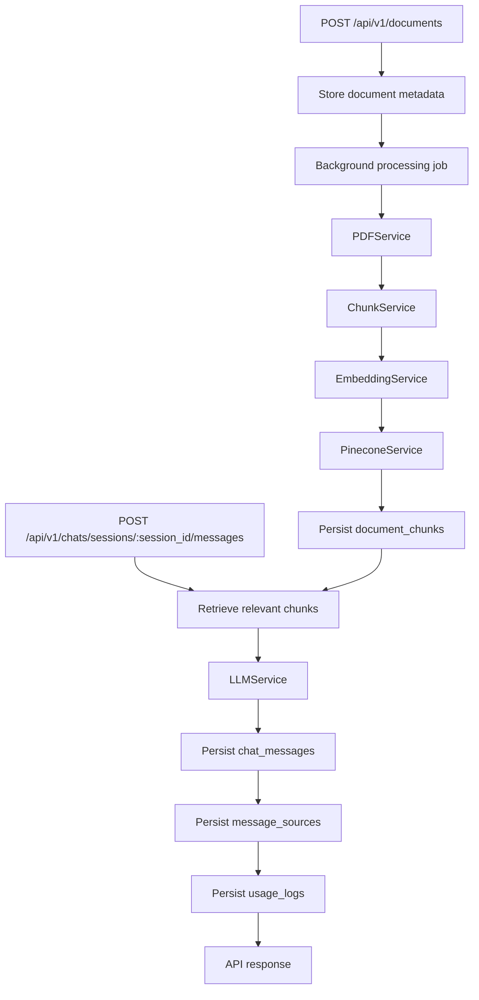

# PDF Backend AI Chatbot

FastAPI backend for a PDF chat system with a production-oriented project structure, async PostgreSQL configuration, protected API documentation, structured logging, and a domain model for document ingestion and retrieval-augmented chat.

## Current State

This repository is best described as a production-shaped backend scaffold rather than a fully production-complete application.

- The FastAPI app, configuration, logging, Docker setup, CI workflow, and SQLAlchemy models are in place.
- End-user authentication is implemented with signup, login, bearer-token auth, Redis + PostgreSQL-backed session tracking, logout, session listing, and rotating refresh tokens.
- The app requires a reachable PostgreSQL database at startup because `/api/v1/health` and the application lifespan both use a real database ping.
- The `DocumentService` and `ChatService` routes currently use in-memory stores, not the SQLAlchemy models.
- PDF parsing, chunking, embedding generation, Pinecone upserts, and LLM answering are still stub implementations in `app/services/`.
- Alembic is configured and the initial schema migration is available in `alembic/versions/3bd016ede9f5_initial_schema.py`.

That distinction matters: the README below documents both the current runtime behavior and the intended production architecture represented by the models and service boundaries.

## Tech Stack

- Python 3.12
- FastAPI
- Uvicorn
- SQLAlchemy 2.0 async
- PostgreSQL via `asyncpg`
- Pydantic v2
- Docker and Docker Compose
- GitHub Actions for CI

## System Overview



## Backend Architecture



## Request Flow



## Database Architecture



## Database Lifecycle



## Document Processing Architecture



## Chat And Citation Architecture



## Target Processing Pipeline



## Project Structure

```text
.
├── app/
│   ├── backend/api/
│   │   ├── dependencies.py
│   │   ├── router.py
│   │   └── routes/
│   ├── core/
│   │   ├── config.py
│   │   └── logging.py
│   ├── db/
│   │   ├── base.py
│   │   └── session.py
│   ├── middleware/
│   │   └── request_logging.py
│   ├── models/
│   ├── schemas/
│   ├── services/
│   ├── logs/
│   ├── Dockerfile
│   └── main.py
├── alembic/
│   ├── env.py
│   ├── script.py.mako
│   └── versions/
├── alembic.ini
├── .github/workflows/backend-ci.yml
├── docker-compose.yml
├── Makefile
└── README.md
```

## API Surface

### Health

- `GET /health`: lightweight root health check that does not hit the database.
- `GET /api/v1/health`: application health check that pings PostgreSQL.

### Documents

- `GET /api/v1/documents/`
- `POST /api/v1/documents/`
- `GET /api/v1/documents/{document_id}`

### Auth

- `POST /api/v1/auth/signup`
- `POST /api/v1/auth/login`
- `POST /api/v1/auth/refresh`
- `GET /api/v1/auth/me`
- `GET /api/v1/auth/sessions`
- `POST /api/v1/auth/logout`

### Auth Token Lifecycle

- `POST /api/v1/auth/login` returns a short-lived `access_token` and a longer-lived `refresh_token`.
- Protected endpoints such as `GET /api/v1/auth/me` validate the access token first against Redis and then against the PostgreSQL fallback session store.
- `POST /api/v1/auth/refresh` rotates the refresh token on every successful use and returns a brand-new access/refresh token pair for the same device session.
- Refresh-token replay is treated as suspicious: if a stale rotated refresh token is reused for an existing session, that session is revoked.
- Auth sessions are stored as one PostgreSQL row per user in `user_auth_sessions`, with each active device session represented as an entry inside the `active_sessions` JSONB array.
- Redis is used as the hot cache for both access-token and refresh-token session metadata, namespaced under the app-level Redis key prefix.

### Chats

- `GET /api/v1/chats/sessions`
- `POST /api/v1/chats/sessions`
- `GET /api/v1/chats/sessions/{session_id}`
- `POST /api/v1/chats/sessions/{session_id}/messages`

### Documentation Endpoints

FastAPI’s default public docs are disabled and recreated behind HTTP Basic auth.

- `GET /docs`
- `GET /redoc`
- `GET /openapi.json`

Docs are enabled only when `DOCS_ENABLED=true`.

## Configuration

Settings are loaded from `app/.env` via `pydantic-settings`.

Use `app/env/.env.example` as the base template.

### Important Environment Variables

| Variable | Purpose |
| --- | --- |
| `PROJECT_NAME` | FastAPI application title |
| `PROJECT_DESCRIPTION` | OpenAPI description |
| `VERSION` | API version |
| `ENVIRONMENT` | Runtime environment label |
| `DEBUG` | Enables debug mode and more verbose behavior |
| `LOG_LEVEL` | Project log level |
| `API_V1_STR` | API version prefix, default `/api/v1` |
| `DB_SCHEME` | `postgresql+asyncpg` or `postgresql` |
| `DB_USERNAME` | PostgreSQL username |
| `DB_PASSWORD` | PostgreSQL password |
| `DB_HOST` | PostgreSQL host |
| `DB_PORT` | PostgreSQL port |
| `DB_NAME` | PostgreSQL database name |
| `DB_ECHO` | SQLAlchemy SQL logging toggle |
| `DB_POOL_SIZE` | Connection pool size |
| `DB_MAX_OVERFLOW` | Overflow connection count |
| `DB_POOL_TIMEOUT` | Pool wait timeout |
| `DB_POOL_RECYCLE` | Connection recycle interval |
| `DB_POOL_PRE_PING` | Enables stale-connection checks |
| `DB_CONNECT_TIMEOUT` | Initial DB connection timeout |
| `DOCS_ENABLED` | Enables authenticated docs routes |
| `DOC_ROOT_USERNAME` | Docs basic auth username |
| `DOC_ROOT_PASSWORD` | Docs basic auth password |
| `JWT_SECRET_KEY` | Secret used to sign access tokens |
| `JWT_ALGORITHM` | JWT signing algorithm, currently `HS256` |
| `JWT_ACCESS_TOKEN_EXPIRE_MINUTES` | Access token lifetime in minutes |
| `JWT_REFRESH_TOKEN_EXPIRE_DAYS` | Refresh token lifetime in days |
| `JWT_ISSUER` | Expected JWT issuer claim |
| `JWT_AUDIENCE` | Expected JWT audience claim |
| `REDIS_ENABLED` | Enables Redis-backed token storage with DB fallback |
| `REDIS_SCHEME` | `redis` or `rediss` |
| `REDIS_HOST` | Redis host |
| `REDIS_PORT` | Redis port |
| `REDIS_PASSWORD` | Redis password if authentication is enabled |
| `REDIS_DB` | Redis database index |
| `REDIS_CONNECT_TIMEOUT` | Redis connection timeout in seconds |
| `REDIS_KEY_PREFIX` | Base Redis key prefix for app-level cache namespaces |

### Notes On Config Behavior

- `ALLOWED_ORIGINS` exists in settings but CORS middleware is not currently attached in `app/main.py`.
- `DOCS_USERNAME` and `DOCS_PASSWORD` are accepted as legacy aliases and mapped to `DOC_ROOT_USERNAME` and `DOC_ROOT_PASSWORD`.
- `REDIS_TOKEN_KEY_PREFIX` is accepted as a legacy alias and mapped to `REDIS_KEY_PREFIX`.
- `DB_SCHEME=postgresql` is normalized internally to `postgresql+asyncpg`.

## Local Development

### Prerequisites

- Python 3.12
- PostgreSQL 14+ or compatible
- Redis Stack or compatible Redis server
- A database matching the values in `app/.env`

### Setup

```bash
python3 -m venv .venv
source .venv/bin/activate
pip install -r app/backend/requirements.txt
cp app/env/.env.example app/.env
```

Update `app/.env` to point at a live PostgreSQL instance and Redis instance before starting the app.

### Database Migration Setup

Apply the initial schema before running the app against a fresh database:

```bash
make migrate-up
```

Useful migration commands:

```bash
make migrate-current
make migrate-history
make migration MESSAGE="describe your schema change"
make migrate-down
```

### Run

```bash
uvicorn app.main:app --reload --host 0.0.0.0 --port 8000
```

Or use the project Make targets:

```bash
make setup
make dev
```

If you are starting from an empty database, run `make migrate-up` after `make setup` and before `make dev`.

### Make Targets

- `make setup`: create venv, install dependencies, and create `app/.env` if missing
- `make dev`: run Uvicorn with reload
- `make run`: run Uvicorn without reload
- `make compile`: compile-check the `app` package
- `make ci`: install deps, run `pip check`, compile sources, and import the FastAPI app
- `make docker-build`: build the container image
- `make docker-up`: start the service with Docker Compose
- `make docker-down`: stop Docker Compose services
- `make docker-logs`: tail backend container logs

## Docker

The repository includes a single backend container definition.

```bash
cp app/env/.env.example app/.env
docker compose up --build
```

Important operational note:

- `docker-compose.yml` only starts the backend container.
- It does not provision PostgreSQL, Pinecone, or any LLM dependency.
- The backend will fail startup if `DB_HOST`, `DB_PORT`, and credentials do not point to a reachable PostgreSQL instance.

## Logging And Observability

Logging is one of the stronger production-oriented parts of this codebase.

- Logs are configured centrally in `app/logger.py`.
- Console and file logging are asynchronous via `QueueHandler` and `QueueListener`.
- Application logs rotate daily and keep 30 backups.
- Service-specific JSON loggers can be created via `get_service_logger(...)`.
- Request logging middleware records request start, completion time, and status code.
- Exceptions during request handling are logged with stack traces.

Log files are written under `app/logs/`.

## CI

GitHub Actions workflow: `.github/workflows/backend-ci.yml`

It currently performs:

- dependency installation
- `pip check`
- Python compile validation with `compileall`
- a smoke import of `app.main:app`

This is useful as a baseline, but it is not yet a full production verification pipeline because there are no automated unit, integration, or migration tests.

## Known Gaps Before True Production Readiness

These are the highest-impact items still missing from the codebase itself:

1. Replace the in-memory document and chat services with repository-backed database logic.
2. Add migrations with Alembic and create the actual database schema from `app/models/`.
3. Implement real PDF extraction, chunking, embeddings, vector search, and LLM orchestration.
4. Add automated auth test coverage and auth-focused rate limiting for login and refresh flows.
5. Add file upload handling and object storage strategy for PDFs.
6. Add CORS middleware if a browser frontend will call this API.
7. Add automated tests for services, routes, DB integration, and failure paths.
8. Add background job orchestration for document processing.

## Summary

This repository already has a solid backbone for a modular PDF chat backend:

- clean FastAPI structure
- strong config validation
- async PostgreSQL engine management
- a well-designed relational schema
- protected docs
- meaningful logging and CI scaffolding

What it does not yet have is the final implementation wiring between the API, the database models, and the AI document-processing pipeline. The README now reflects that reality directly so future contributors can build on it safely.
